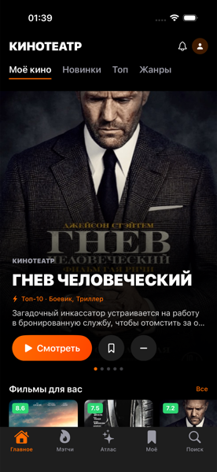
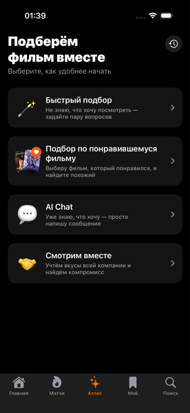
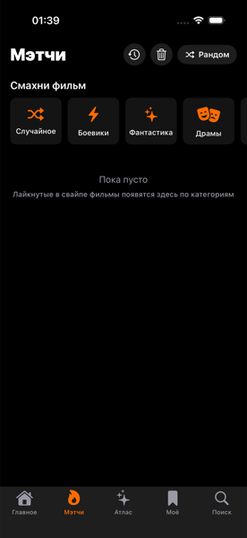

# Атлас — AI-помощник по выбору фильма

Прототип для продуктового кейса: **не отдельное приложение, а новая вкладка
внутри существующего онлайн-кинотеатра**. Вокруг фичи собрана лёгкая копия
самого кинотеатра (каталог, карточка фильма, «Буду смотреть», поиск) — чтобы
показать фичу в реалистичном контексте, а не в вакууме.

Задача фичи — сократить время выбора фильма и довести пользователя до кнопки
«Смотреть», а не улучшить сами рекомендации.

  

## Что внутри

**Вкладка «Атлас» — 4 сценария подбора:**

| Сценарий | Когда нужен |
|---|---|
| Быстрый подбор | Не знаю, что хочу — задайте пару вопросов |
| Подбор по фильму | Понравился конкретный фильм, найдите похожее |
| AI Chat | Уже знаю, что хочу — напишу текстом |
| Смотрим вместе | Компания 2–5 человек, нужен компромисс |

**Вкладка «Мэтчи» — свайп-подбор:** тиндер-подобная колода (вправо — нравится,
влево — мимо), лайки копятся по жанровым полкам и подмешиваются в промпт ИИ.

**Общий экран результатов** для всех сценариев: карточки с % совпадения,
объяснением «почему именно этот фильм», кнопкой «не то — покажи ещё» и
рулеткой «выбери за меня» (взвешена по % совпадения).

**Замкнутый цикл:** после «Смотреть» — мини-опрос «как вам фильм?», оценки
копятся в `TasteProfileStore` и уходят в промпт следующих запросов.

## Запуск

Нужен Xcode 16+ и iOS 18 SDK (проект использует `onScrollVisibilityChange`).

```bash
open MovieAssistant.xcodeproj   # выбрать симулятор iPhone → ⌘R
```

Файл проекта закоммичен, поэтому XcodeGen не обязателен. Если меняете структуру
файлов — можно перегенерировать из `project.yml` (`xcodegen generate`), но тогда
проверьте, что папки `Resources/Stills` и `Resources/Trailers` попали в bundle.

### API-ключ

AI-сценарии требуют ключ OpenAI. Файл с ключом **не хранится в репозитории**:

```bash
cp MovieAssistant/Core/Services/Config.example.swift \
   MovieAssistant/Core/Services/Config.swift
```

и вписать свой ключ в `Config.swift` (он в `.gitignore`).

Без ключа приложение запускается и весь каталог/свайп/избранное работают —
ошибку покажут только AI-сценарии.

## Архитектура

MVVM. Экран = отдельный файл, сетевая и AI-логика во View не живёт.

```
App/            тема, таб-бар, переиспользуемые вьюхи (постер, карусель кадров)
Core/Models/    Movie, UserPreferenceProfile, RecommendationResult, ...
Core/Services/  каталог, AI-клиент, промпты, хранилища (UserDefaults)
Features/       по фиче: Home, MovieDetail, AIAssistant/*, SwipeDiscovery, ...
Resources/      movies.json, Posters/, Stills/, Trailers/
```

**Ключевые решения:**

- **Все 5 точек входа сходятся в одну модель.** Любой сценарий строит
  `UserPreferenceProfile` → `AIRecommendationService.recommend(profile:)` →
  общий экран результатов. Сервис не знает, из какого сценария пришёл профиль.

- **ИИ не может выдумать фильм.** В промпт уходит весь локальный каталог, ответ
  приходит как JSON с `movieId`, и каждый id резолвится по каталогу на стороне
  приложения — несуществующий id просто отбрасывается
  (`OpenAIRecommendationService`).

- **Жанровые пересечения считаются кодом, не моделью.** В сценарии «Смотрим
  вместе» пересечение жанров участников вычисляется детерминированно и
  передаётся модели готовым списком — иначе она склонна натягивать сходство по
  атмосфере вместо реального совпадения жанров (`PromptBuilder`).

- **Всё за протоколами.** `MovieCatalogProviding` и `AIRecommendationService` —
  протоколы: локальный `movies.json` меняется на реальный каталог, а прямой
  вызов OpenAI на backend-прокси, без переписывания экранов.

## Осознанные упрощения прототипа

Это демо для защиты кейса, а не продакшн:

- **Ключ ИИ лежит в приложении.** В реальном сервисе нужен backend-прокси:
  спрятать ключ, держать лимиты и менять промпт без релиза. Протокол
  `AIRecommendationService` для этого и отделён от реализации.
- **Каталог — 36 фильмов в JSON**, только фильмы, без сериалов.
- **Плеера нет.** «Смотреть» открывает опрос «как вам фильм?» — так в прототипе
  эмулируется сигнал о завершённом просмотре.
- **Данные — в UserDefaults**, без аккаунтов и синхронизации между устройствами.
- **Трейлеры — локальные файлы** (`Resources/Trailers/trailer_<id>.mp4`):
  встроенный YouTube-плеер упирается в анти-бот защиту самого YouTube и
  не проигрывается ни на симуляторе, ни на устройстве.
